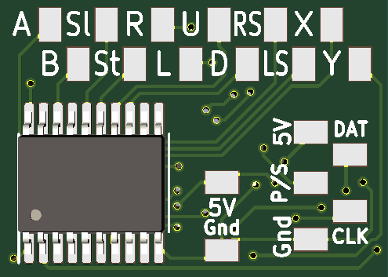
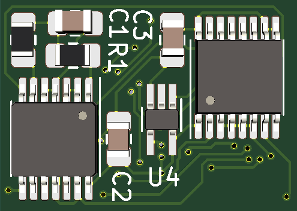

# SNES Controller Decoder #
It's a receiver for Super Nintendo Controllers.

I use it to drive the button inputs on the IS-NITRO CAPTURE dev console.
With some soldering skills, one could adapt it for any application where up
to twelve switches need to be controlled from a distance. For example, you can use the snesdecoder 
to play your Neo Geo console or JAMMA arcade game with your SNES controller.

## Design Sketch ##
The SNES controller takes 4 inputs (GND, 5V, CLK, and LATCH) and sends one serial output for button press data.
This board routes power to the controller and provides the clock & latch signals to drive it.
The button data from the controller is sent back to the decoder pcb, which outputs the buttons in parallel.

The clock is generated using a ring oscillator whose period is set by an external RC time constant. See [Fairchild AN-118](https://www.onsemi.com/pub/Collateral/AN-118.pdf.pdf). 
The ripple carry output of a 4-bit counter supplies the latch signal. This way, the SNES controller is polled every 16 clock cycles, which is enough time to transmit a full data packet. The counter also drives the register clock on the shift register(s), thereby updating the open drain outputs to reflect the button data of the preceding packet until the next packet is received.

To produce a working board, some quirks were taken into account:

The SNES button data is logic high when a button is NOT pressed, so the data stream needs to be inverted before going to the shift register(s) for canonical switch behavior, i.e. not pressed -> open circuit. Also, the latch and clock outputs going to the controller need dedicated buffers, otherwise the interference between the wires in the controller cable feeds back to the decoder board, causing malfunctions. Lastly, the clock signal being fed to the shift register(s) should be inverted so the button states are sampled from the data stream roughly at the midpoint of each button's time-bin.

Detailed info about the SNES contoller can be found on [GameSX](https://gamesx.com/controldata/snesdat.htm)

## Motivation ##
This project was inspired by an [old forum post](https://nfggames.com/forum2/index.php?msg=26296) on NFGgames
I wanted to use my SNES controller on other consoles, but I felt a universal computer would be 
overkill for accomplishing that. All of the existing solutions that I'm aware of use a computer or custom logic. 
With discrete components that don't require programming, this design is trasparent about what it does, and is
reminiscent of the simpler times when transistors were more expensive and packaging less so by comparison :P
